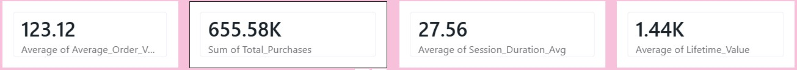
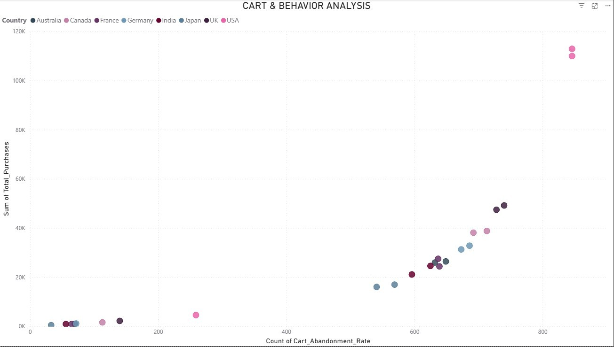

# 📊 Customer Behavior & Churn Analysis

## 🚀 Project Overview
This project focuses on analyzing customer behavior and identifying churn patterns to help businesses improve customer retention and make data-driven decisions.

Using real-world datasets, this analysis transforms raw data into actionable insights by applying data cleaning, exploratory data analysis (EDA), and visualization techniques.

---

## 🎯 Objectives
- Understand customer behavior patterns  
- Identify key factors contributing to customer churn  
- Segment customers based on activity and engagement  
- Provide actionable insights to improve retention  
- Support business decision-making using data  

---

## 🛠️ Tech Stack

### 💻 Programming & Querying
- Python  
- SQL  

### 📚 Libraries & Tools
- Pandas  
- NumPy  
- Matplotlib  
- Seaborn  
- SQLAlchemy  

### 📊 Data Visualization
- Power BI  

### 🗄️ Database
- MySQL  

---

## ⚙️ Project Workflow

1. **Data Collection**
   - Imported raw dataset (50K+ records)

2. **Data Cleaning & Preprocessing**
   - Handled missing values using imputation techniques  
   - Removed duplicates  
   - Outlier treatment using IQR method  

3. **Exploratory Data Analysis (EDA)**
   - Customer segmentation  
   - Purchase behavior analysis  
   - Session activity insights  

4. **Feature Engineering**
   - Created new meaningful features  
   - Improved data quality for analysis  

5. **Data Visualization**
   - Built interactive dashboards in Power BI  
   - Visualized key metrics and KPIs  

---

## 📊 Key Features / Analysis

- Customer Segmentation  
- Churn Analysis  
- Purchase Frequency Analysis  
- Session Duration vs Engagement  
- High-value customer identification  

---

## 📸 Project Screenshots

### 📊 Dashboard

### 📈 Cart & Behavior Analysis

### 🔥 Customer_Engagement vs purchase_behavior

### 💡 Session_Duration_Avg

---

## 💡 Key Insights

- Customers with low session duration are more likely to churn  
- High engagement users show higher purchase frequency  
- Certain customer segments contribute to most revenue  
- Inactive users have a significantly higher churn rate  

---

## 📌 Use Cases

- 📈 Improve customer retention strategies  
- 🎯 Target high-risk churn customers  
- 💰 Increase revenue through customer segmentation  
- 📊 Optimize marketing campaigns  
- 🧠 Support business decision-making  

---

## 📉 Why Are Customers Churning?

Based on the analysis:

1. **Low Engagement**
   - Customers with shorter session duration tend to churn more  

2. **Lack of Personalization**
   - Generic experience reduces customer interest  

3. **Infrequent Interaction**
   - Users who don’t return frequently are at high risk  

4. **Poor User Experience**
   - Complex navigation or slow performance  

5. **No Targeted Offers**
   - Lack of incentives for returning users  

---

## 🛠️ How to Reduce Churn

- 🎯 Personalized recommendations using user behavior  
- 📩 Email & notification campaigns for inactive users  
- 🎁 Loyalty programs and rewards  
- ⚡ Improve user experience (UI/UX optimization)  
- 📊 Predictive models to identify churn early  

---

## 📈 Growth Strategies

### 🚀 Short-Term
- Target inactive users with offers  
- Improve onboarding experience  
- Run engagement campaigns  

### 📊 Mid-Term
- Build customer segmentation models  
- Implement recommendation systems  
- Optimize pricing strategies  

### 🌟 Long-Term
- Use machine learning for churn prediction  
- Develop personalized user journeys  
- Build customer loyalty ecosystem  

---

## 🧠 Future Improvements

- Implement Machine Learning models for churn prediction  
- Deploy project as a web dashboard  
- Automate data pipeline  
- Integrate real-time analytics  

---

## 📬 Conclusion

This project demonstrates how raw customer data can be transformed into meaningful insights that drive business growth. By identifying churn patterns and understanding customer behavior, businesses can take proactive steps to improve retention and maximize revenue.

---
